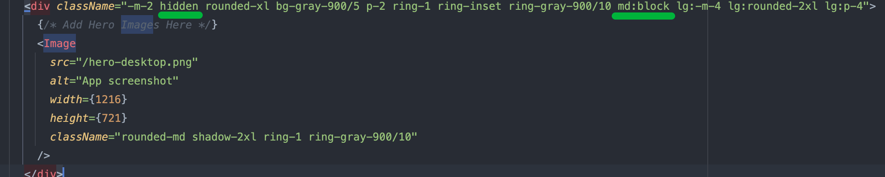

[toc]

## 项目启动

First, run the development server:

```bash
安装依赖
npm install

npm run dev
# or
yarn dev
# or
pnpm dev
# or
bun dev
```

预览地址[http://localhost:3000](http://localhost:3000) 

这个项目使用 [`next/font`](https://nextjs.org/docs/basic-features/font-optimization) 自动优化和加载自定义 Google 字体 Inter。

## 课程目标
构建一个简化版本的财务仪表板，具备开始构建全栈 Next.js 应用程序所需的基本技能。
其中包含：
- 公共主页
- 登陆页面
- 受身份验证保护的仪表板页面。即路由守卫
- 发票的增删改查

> 前置知识

假设已对 React 和 JavaScript及TailwindCSS的使用有基本的了解。例如组件、props、状态和钩子，以及服务器组件和 Suspense等新功能。

## 你将学习到

- **Styling**: The different ways to style your application in Next.js.
  样式：在 Next.js 中设置应用程序样式的不同方法。
- **Optimizations**: How to optimize images, links, and fonts.
  优化：如何优化图像、链接和字体。
- **Routing**: How to create nested layouts and pages using file-system routing.
  路由：如何使用文件系统路由创建嵌套布局和页面。
- **Data Fetching**: How to set up a database on Vercel, and best practices for fetching and streaming.
  数据获取：如何在 Vercel 上设置数据库，以及获取和流式传输的最佳实践。
- **Search and Pagination**: How to implement search and pagination using URL Search Params.
  搜索和分页：如何使用 URL 搜索参数实现搜索和分页。
- **Mutating Data:** How to mutate data using React Server Actions, and revalidate the Next.js cache.
  改变数据：如何使用 React Server Actions 改变数据，并重新验证 Next.js 缓存。
- **Error Handling:** How to handle general and `404` not found errors.
  错误处理：如何处理一般错误和 `404` 未找到错误。
- **Form Validation and Accessibility:** How to do server-side form validation and tips for improving accessibility.
  表单验证和可访问性：如何进行服务器端表单验证以及提高可访问性的提示。
- **Authentication**: How to add authentication to your application using [`NextAuth.js`](https://next-auth.js.org/) and Middleware.
  身份验证：如何使用 `NextAuth.js` 和中间件向应用程序添加身份验证。
- **Metadata**: How to add metadata and prepare your application for social sharing.
  元数据：如何添加元数据并准备您的应用程序以进行社交共享。

## 项目结构

```bash
├── public                     # 包含应用程序的所有静态资源，例如图像
│   │── favicon.ico            # favicon
│   └── index.html             # index.html template
├── scripts    								 # 填充数据库用的脚本。
├── src                        # 
│   ├── app                    # 
│   		├── assets             #静态资源 
│   		├── lib             	 # 存放工具类和数据获取函数
│   		├── ui             	   # UI 组件，例如卡片、表格和表单
│   		├── components         # 组件
│   		├── icons              # svg icons
│   		├── lang               # i18n 插件
│   		├── layout             # 公共布局
│   		├── store              # 全局状态管理
│   		├── styles             # 样式
│   		├── utils              # 工具函数
│   		├── layout.tsx         # 页面根布局
│   		└── 暂无      # 暂无
├── .eslintrc.js               # eslint config
├── .travis.yml                # automated CI configuration
├── tailwind.config.js         # tailwind config
├── next.config.ts         		 # next config
├── postcss.config.js          # postcss config
├── ts.config.json          	 # typescript config
└── package.json               # package.json
```

## 环境配置

## 课程章节
### 1.创建 Next.js 应用并运行开发服务器。

#### 1.1创建模板

terminal中使用脚手架创建next.js模板

```
npx create-next-app@latest nextjs-dashboard --use-npm --example "https://github.com/vercel/next-learn/tree/main/dashboard/starter-example"
```

切换到项目目录

```
cd nextjs-dashboard
```

#### 1.2安装依赖

```
npm install
```

#### 1.3本地环境下启动开发服务器

```
npm run dev
```

#### 1.4预览

浏览器中预览它们。预览地址[http://localhost:3000](http://localhost:3000) 

您的主页现在应该如下所示：


> 也许你会感到很惊讶，这么多东西关于Next.js该如何下手，别担心，现在你无需过度关注生成的CSS页面，我都已经提前为你准备好了。下面就跟着我一步步来体验和尝试Next.js中的特性

### 2.在Next.js中应用CSS样式

在页面根布局`layout.txs`中为项目引入全局CSS样式。

what is 根布局？先别管

查看 `/app/ui` 文件夹，看到一个名为 `global.css` 的文件。


#### 开始之前

Tailwind 是一个原子化CSS 框架，允许你直接在 TSX 标记中快速编写框架提前定义好的CSS类，从而加快开发过程。

当你使用 `create-next-app` 启动新项目时，Next.js 会询问您是否要使用 Tailwind。请务必选择 `yes` ，Next.js 将自动安装必要的包并在你的应用程序中配置 Tailwind。

为了节省时间，我已经提前准备好了你将使用的所有组件的样式。

#### 2.1为项目应用全局样式

`通过/app/ui/global.css尝试修改全局样式`

使用此文件将 CSS 规则添加到应用程序中的所有路由 - 例如 CSS 重置规则、链接等 HTML 元素的站点范围样式等，在此文件`global.css` 中声明的所有css样式，将作用于项目下的所有页面。

```
import '@/app/ui/global.css';
 
export default function RootLayout({
  children,
}: {
  children: React.ReactNode;
}) {
  return (
    <html lang="en">
      <body>{children}</body>
    </html>
  );
}
```

#### 2.2为单独页面应用样式

如果你查看 `/app/page.tsx` ，你会发现我们在示例中使用了 Tailwind 类。


#### 2.3CSS Modules

如果您更喜欢编写传统的 CSS 规则或将样式与 JSX 分开 - CSS 模块是一个很好的选择。

CSS 模块允许您通过自动创建唯一的类名来将 CSS 范围限定为组件，因此您也不必担心样式冲突。

在 `/app/ui` 内，创建一个名为 `home.module.css` 的新文件并添加任意CSS 规则：

```
.btn-primary{
    font-size: 2rem;
    color: orange;
}
```

然后，在 `/app/page.tsx` 文件中导入样式并用 `styles["btn-primary"]` 替换 开始使用按钮`<div>` 中的 Tailwind 类名称：

```
import styles from '@/app/ui/home.module.css';
<div className={styles["btn-primary"]} />;
```

保存更改并在浏览器中预览它们。你应该看到与之前相同的形状。

Tailwind 和 CSS Modules是设计 Next.js 应用程序样式的两种最常见的方法。无论使用其中一种还是另一种，都取决于个人偏好 - 你甚至可以在同一个应用程序中同时使用两者！

但为了方便演示，接下来的步骤都全程使用`tailwindcss`来进行演示

#### 2.4.关于动态切换类名

在某些情况下，可能需要根据状态或其他条件有条件地设置元素的样式。

`clsx` 或`classnames`是一个可让你轻松切换类名称的库。

#### 2.5.其他方案

- 使用SASS
- 使用CSS-in-JS方案

#### 课后思考:

为什么要使用CSS模块化，有什么好处吗，可以展开来说说吗？

https://github.com/css-modules/css-modules

- 防止命名冲突

CSS 模块使用本地作用域来避免不同项目部分之间的样式冲突，从而允许组件作用域内的样式设置。

- 明确样式依赖

将样式导入到各自的组件中可以明确哪些样式影响哪些区域，从而增强代码的可读性和可维护性。

- 解决全局范围问题

CSS 模块通过将样式本地化到特定组件，防止一个文件中影响整个项目的常见样式问题。

- 提高可重用性和模块化性

CSS 模块允许在不同模块中使用相同的类名，从而促进模块化、可重用的样式。


### 3.使用 Next.js 优化字体和图像

#### 3.1优化图像和字体的目的

**可以从性能、用户体验、降本增效说起**

> 优化图像和字体对于提高网站性能、用户体验以及降低运营成本都非常重要

- **移动设备性能优化**

在移动设备上，带宽和处理能力可能有限。通过优化图像和字体，可以减少移动设备上的资源消耗，加载速度更快。

- **响应式设计支持**

在响应式网站设计中，网站必须适应不同设备和屏幕尺寸。通过优化图像和字体，可以提供适合不同分辨率和屏幕尺寸的资源，使网站在各种设备上加载更快并呈现更好的外观。

- **页面加载速度优化**

大图像和未经优化的字体文件会增加网页的加载时间。优化图像和字体可以减少页面的文件大小，从而`加快页面加载速度`。这对于`提高用户体验`和`用户留存率`非常关键，因为用户更倾向于访问加载速度更快的网站。

- **节省带宽**

优化图像和字体可以`节省服务器带宽`。减少传输的数据量有助于`降低服务器负载`，同时也`降低了网站的运营成本`，特别是对于流量较大的网站来说尤为重要。

- **提高搜索引擎排名(SEO)**

网站加载速度是搜索引擎排名的一个重要因素之一。通过优化图像和字体，可以提高网站的加载速度，从而有助于提高在搜索引擎中的排名。

- **减少累积布局偏移**

**Cumulative Layout Shift**(简称CLS)是 Google 用于评估网站性能和用户体验的指标

对于字体，当浏览器最初以后备字体或系统字体呈现文本，然后在加载后将其交换为自定义字体时，就会发生布局转换。这种交换可能会导致文本大小、间距或布局发生变化，从而移动其周围的元素。

对于图像，防止图像加载时布局发生变化


#### 3.2用next/font优化字体

使用 `next/font` 模块时，Next.js 会自动优化应用程序中的字体。**Next会在构建时下载字体文件并将它们与其他静态资产一起托管。**这意味着当用户访问您的应用程序时，不会出现会影响性能的额外网络请求字体。

##### 3.2.1引入并初始化字体

向项目添加自定义 Google 字体，并观察它是如何工作的

在`/app/ui`文件夹中，创建一个名为 的新文件`fonts.ts`。我们将使用此文件来存放将在整个项目中使用的字体相关配置。

`/app/ui/fonts.ts`

```
//这个代码的作用是引入了Google Fonts中的Noto_Sans字体
import { Noto_Sans } from 'next/font/google';

export const notoSans = Noto_Sans({
  subsets: ['latin'],//指定了使用的字符集为 latin
  style: ['italic', 'normal'],//指定字体样式
  weight: ['300', '500', '700'],//指定字体粗细
  variable: '--noto-sans',  // 指定使用css变量方法时的字体变量名
});

```

variable 选项配置例子：

- `variable: '--font-inter'` ：声明 CSS 变量 `--font-inter`

使用的CSS变量方法的时候将可以使用声明的CSS变量


`notoSans`从模块导入字体`next/font/google`- 这说我们本次课程所使用的主要字体。然后指定哪个[子集](https://fonts.google.com/knowledge/glossary/subsetting)你想加载。在这种情况下，`'latin'`：

> 这里需要了解一些背景知识。某些字体为了支持不同的语言和符号，通常包含多个字符集。 如果我们不指定字符集，通常网页加载的字体文件会包含所有字符集。而包含多个字符集的字体文件通常体积更大，这会影响到页面的加载时间，特别是在网络连接速度较慢的情况下。
>
> 了解了这些后回到项目代码。因为这个项目是个文字内容只有英文的网页。若我们要使用`Inter`字体，在实例化`Inter`字体时，可以特别声明，我们只需要`latin`字符集，用于支持英文。
>
> 这样可以缩小字体体积，减少不必要的资源加载，优化网页性能。

##### 3.2.2为整个项目应用字体

`/app/layout.tsx`

```
import type { Metadata } from 'next';
import { notoSans } from '@/app/ui/fonts';
import './globals.css';

export const metadata: Metadata = {
  title: 'MyAdmin',
  description: 'Generated by create next app',
};

export default function RootLayout({
  children,
}: {
  children: React.ReactNode;
}) {
  return (
    <html lang="en">
      <body className={`${notoSans.className} antialiased`}>{children}</body>
    </html>
  );
}

```

像这样，通过添加`Noto_Sans`到`<body>`元素，字体将作用于整个项目。在这里，我们还添加了 Tailwind[`antialiased`](https://tailwindcss.com/docs/font-smoothing)平滑字体的类。没有必要使用这个类，但它增加了一个不错的感觉。

> `/app/layout.tsx`这称为根布局并且是必需的。添加到根布局的任何 UI 将在所有页面之间共享。可以使用根布局来修改 `<html>` 和 `<body>` 标记，并添加元数据

ok，让我们回到浏览器界面，F12，打开开发工具并选择`body`元素。可以看到`Noto_Sans`并且`Noto_Sans_Fallback`现在已应用在样式下


##### 3.2.3为局部应用字体

还可以将字体添加到项目的特定元素。只需要将对应的类名绑定在非`<body>`的对应标签上即可

##### **练习**使用自定义字体

现在轮到你了！在你的`fonts.ts`文件中，导入名为 的汉字字体`ZCOOL_XiaoWei`并将其应用到/app/pa ge.tsx`<h1>`元素。除了像以前一样指定子集之外，你还需要指定字体**粗细**。

`/app/ui/fonts.tsx`

```
import { Inter, Noto_Sans, ZCOOL_XiaoWei } from 'next/font/google';

export const inter = Inter({ subsets: ['latin'] });
export const notoSans = Noto_Sans({
  subsets: ['latin'],
  style: ['italic', 'normal'],
  weight: ['300', '500', '700'],
  variable: '--noto-sans',
});

export const zcoolXiaoWei = ZCOOL_XiaoWei({
  subsets: ['latin'],
  style: ['normal'],
  weight: ['400'],
  // 指定生成的字体变量名
  variable: '--ZCOOL-XiaoWei',
});

```

`/app/page.tsx`

```
import { ArrowRightIcon } from '@heroicons/react/24/outline';
import Link from 'next/link';
import Image from 'next/image';
import Nav from '@/app/components/nav';
import logo from '@/assets/img/logo.svg';
import { zcoolXiaoWei } from '@/app/ui/fonts';
import clsx from 'clsx';
 
export default function Page() {
  return (
    // ...
    <h1 
    className={clsx(`text-4xl font-bold tracking-tight text-gray-900 sm:text-6xl ${zcoolXiaoWei.className}`
  )}
>
  欢迎来到 DashEase.
</h1>
    // ...
  );
}

```

#### 3.3用next/image优化图像

太棒了，现在已经向项目添加了两种自定义字体！接下来，让我们向主页添加Hero图片并对图片进行优化

Next.js 可以在**顶级[`/public`](https://nextjs.org/docs/app/building-your-application/optimizing/static-assets)**目录下提供静态资源，例如图像。`/public`里面的文件可以在你的项目中引用。


在以往常规的HTML中,我们使用图片可能会这样做:

```

```

但是这样做有几个需要手动进行处理的地方

- [需要确保图片在不同的屏幕尺寸上都能响应](https://developer.mozilla.org/zh-CN/docs/Learn/HTML/Multimedia_and_embedding/Responsive_images)。

```

```

- 需要指定不同设备的图像尺寸，根据不同设备的屏幕大小载入合适分辨率的图片。

例如为了在宽屏和窄屏上都能显示合适的图片，我们可能会写如下所示这样的代码：

```
<picture>
  <source media="(max-width: 799px)" srcset="elva-480w-close-portrait.jpg" />
  <source media="(min-width: 800px)" srcset="elva-800w.jpg" />
  
</picture>
```

- 需要防止图像加载时布局发生变化(累积布局偏移)。


在网络的早期，开发人员在其 `` 标记中添加了 `width` 和 `height` 属性，以确保在浏览器开始获取之前在页面上分配了足够的空间图片。这将最大限度地减少回流和重新布局。

```

```

此示例中的 `width` 和 `height` 不包含单位。这些“像素”尺寸将确保浏览器保留 640x360 的区域。无论真实尺寸是否与其匹配，图像都会拉伸以适合该空间。

当响应式网页设计被引入时，开发人员开始使用 CSS 来调整图像大小，而不是 `width` 和 `height` ：

```
img {
  width: 100%; /* or max-width: 100%; */
  height: auto;
}
```

但是，由于未指定图像大小，因此在浏览器开始下载图像并确定其尺寸之前，无法为其分配空间。当图像加载时，文本会向下移动页面以为它们腾出空间，从而造成令人困惑和令人沮丧的用户体验。

- 延迟加载用户视口之外的图像。(懒加载)

别担心，这些在使用Next.js后无需再手动进行处理。使用`next/image` 组件自动优化图像，而不是手动实现这些优化。

##### 3.3.1引入内置Image组件

> `<Image>` 组件是 HTML `` 标签的扩展，并且具有自动图像优化功能，例如：

- 加载图像时自动防止累积布局偏移。
- 移动端性能优化，调整图像大小以避免将大图像传送到具有较小视口的设备。
- 默认情况下延迟加载图像（图像在进入视口时加载）。
- 当浏览器支持时，以现代格式（例如 WebP 和 AVIF）提供图像。像 [WebP](https://developer.mozilla.org/zh-CN/docs/Web/Media/Formats/Image_types#webp_image) 和 [AVIF](https://developer.mozilla.org/zh-CN/docs/Web/Media/Formats/Image_types#avif_image) 等新型图片格式可以做到高质量的同时保持较低的文件大小，如今这些格式已有相对广泛的浏览器支持，且几乎没有“历史包袱”。

`/app/page.tsx`

```
import Image from 'next/image';
```

让我们使用 `<Image>` 组件。如果您查看 `/public` 文件夹内部，会看到有两个图像： `hero-desktop.png` 和 `hero-mobile.png` 。这两个图像完全不同，它们的显示取决于用户的设备是台式机还是移动设备。


添加图片：

`/app/page.tsx`

```
//...省略
import Image from 'next/image';
//...省略

export default function Page() {
  return (
    <main className="flex min-h-screen flex-col">
			{/* Add Hero Images Here */}
       <Image
        src="/hero-desktop.png"
        alt="App screenshot"
        width={1216}
        height={721}
        className="rounded-md shadow-2xl ring-1 ring-gray-900/10"
        />
    </main>
  );
}
```

 `width` 设置为 `1216` ，将 `height` 设置为 `721` 像素。最好指定图像的 `width` 和 `height` 以[预防布局偏移](https://web.dev/articles/optimize-cls#images-without-dimensions)，它们的宽高比应与源图像相同。

类 `hidden` 用于从移动屏幕上的 DOM 中删除图像，而 `md:block` 用于在桌面屏幕上显示图像。



ok保存更改，回到浏览器，我们的主页现在应该是这样的：


##### 练习:添加移动端的Hero图像

现在轮到你了！在刚刚添加的图像下，为 `hero-mobile.png` 添加另一个 `<Image>` 组件。

- 该图像的 `width` 像素应为 `560` ， `height` 像素为 `620` 。
- 它应该显示在移动屏幕上，并隐藏在桌面上 - 你可以使用开发工具检查桌面和移动图像是否正确交换。

#### 课后思考

你可能对下列的描述感到困惑

> **Next会在构建时下载字体文件并将它们与其他静态资产一起托管**。为什么说不会产生额外的网络请求?

在构建过程中例如 `next build`，Next.js 会下载字体文件并将它们与其他静态资产一起托管。这意味着字体文件将会被打包进你的 Next.js 应用程序的构建输出中例如dist文件夹。当用户访问你的应用程序时，这些字体文件将会从与应用程序相同的服务器上提供，而不需要额外的网络请求。这样就避免了从外部 CDN 或字体服务器请求字体文件的网络开销，因此说不会产生额外的网络请求。

> [发生累积布局偏移CLS常见的原因有？](https://web.dev/articles/optimize-cls#common-causes-of-cls)

- 没有尺寸的图像
- 广告、嵌入内容和其他延迟加载的内容
- 网络字体

**参考文档**

- [图像优化](https://nextjs.org/docs/app/building-your-application/optimizing/images)
- [字体优化](https://nextjs.org/docs/app/building-your-application/optimizing/fonts)
- [利用图像提高 Web 性能](https://developer.mozilla.org/en-US/docs/Learn/Performance/Multimedia)
- [网络字体](https://developer.mozilla.org/en-US/docs/Learn/CSS/Styling_text/Web_fonts)

### 4.创建布局和页面以及路由

到目前为止，整个项目只有一个主页。下面让我们了解如何使用布局和页面创建更多路由。

#### 4.1使用Next嵌套路由创建仪表盘页面和公共layout

> [Next.js 提供了一组特殊文件来创建在嵌套路由中具有特定行为的 UI：](https://nextjs.org/docs/app/building-your-application/routing#file-conventions)你需要按照以下约定来创建文件名

| 文件名(约定好的不能更改的名字) | 作用                                                         |
| ------------------------------ | ------------------------------------------------------------ |
| layout                         | 段及其子段的共享 UI，例如 ( `/app/dashboard/layout.tsx` ) 是`/app/dashboard/*`独有的，任何匹配到的路由都将共享这一UI。 |
| page                           | 路由的出口，可公开访问的                                     |
| loading                        | 段及其子段进行加载时所展示的UI                               |
| not-found                      | 未匹配到段及其子段路由时的 UI                                |
| error                          | 段及其子段发生错误时的 UI                                    |
| global-error                   | 全局错误用户界面                                             |
| route                          | 服务器端 API 端点，可用于创建后端API                         |
| template                       |                                                              |
| default                        |                                                              |

你可以使用 `layout.tsx` 和 `page.tsx` 文件为每个路由创建单独的布局的UI。

`page.tsx` 是一个特殊的 Next.js 文件，用于导出 React 组件，并且需要它才能访问路由。在项目app目录中中，已经提前创建有一个页面文件： `/app/page.tsx` - 这是与根路径 `/` 关联的主页。


`/app/dashboard/page.tsx` 与 `/dashboard` 路径关联。下面让我们创建页面来看看它是如何工作的！

在 `/app` 内创建一个名为 `dashboard` 的新文件夹。然后，在 `dashboard` 文件夹中创建一个新的 `page.tsx` 文件，其中包含以下内容：

`/app/dashboard/page.tsx`

```
export default function Page() {
  return <p>仪表盘页面</p>;
}
```

运行npm run dev

本地开发环境访问http://localhost:3000/dashboard，可以看到“仪表板页面”文本。

以上就是在 Next.js 中创建不同页面的方法：使用文件夹创建一个新的路由段，并在其中添加一个 `page` 文件。

> 通过为 `/page` 文件指定一个特殊名称，Next.js 允许你将 UI 组件、测试文件和其他相关代码与你的路由并置。只有 `page` 文件中的内容可以公开访问。例如， `/ui` 和 `/lib` 文件夹与你的路径一起位于 `/app` 文件夹内。

让我们按照以上方法继续创建以下两个页面

- 客户页面

  该页面应可通过 http://localhost:3000/dashboard/customers 访问。目前，它应该返回一个 `<p>客户页面</p>` 元素。

  ```
  export default function Page() {
    return (
      <div className="flex min-h-screen w-screen items-center justify-center bg-[#F4F9FD]">
        客户页面
      </div>
    );
  }
  ```

  

- 发票页面

  发票页面应可通过 http://localhost:3000/dashboard/invoices 访问。现在，还返回一个 `<p>发票页面</p>` 元素。

  ```
  export default function Page() {
    return (
      <div className="flex min-h-screen w-screen items-center justify-center bg-[#F4F9FD]">
        发票页面
      </div>
    );
  }
  ```

  

> 仪表盘具有某种跨多个页面共享的导航。在 Next.js 中，我们使用特殊的 `layout.tsx` 文件来创建在多个页面之间共享的 UI。让我们为仪表板页面创建一个布局！

在 `/dashboard` 文件夹中，添加一个名为 `layout.tsx` 的新文件并粘贴以下代码：

`/app/dashboard/layout.tsx`

```
import SideNav from '@/app/ui/dashboard/sidenav';
 
export default function Layout({ children }: { children: React.ReactNode }) {
  return (
    <div className="flex h-screen flex-col md:flex-row md:overflow-hidden">
      <div className="w-full flex-none md:w-64">
        <SideNav />
      </div>
      <div className="flex-grow p-6 md:overflow-y-auto md:p-12">{children}</div>
    </div>
  );
}
```

在此布局页中，将 `<SideNav />` 组件导入到layout.tsx当中。任何导入到此文件中的任何组件都将成为`/app/dashboard/`布局的一部分，在没有任何自定义情况下。所有匹配`/app/dashboard/*`的路由都将共享相同的UI界面

`<Layout />` 组件接收 `children` 属性。该子项可以是页面或其他布局。在当前项目里， `/dashboard` 内的页面将自动嵌套在 `<Layout />` 内，如下所示：


保存更改并预览来检查一切是否正常工作。看到以下内容：


> 在 Next.js 中使用布局的好处之一是，在导航时，只有页面组件会更新，而布局不会重新呈现。这称为部分渲染：


#### 了解什么是共置、部分渲染和根布局。

[关于并置:](https://medium.com/trabe/colocating-react-component-files-the-tools-you-need-c377a61382d3)

- 关于嵌套路由:

Next.js 使用文件系统路由，其中文件夹用于创建嵌套路由。每个文件夹代表一个映射到 URL 段的路由段。

要创建嵌套路由，可以将文件夹相互嵌套。例如，可以通过在 `app` 目录中嵌套两个新文件夹来添加新的 `/dashboard/invoices` 路由。

路由由三段组成：

- `/` (Root segment，也称为根段) `/` （也称为根段）
- `dashboard` (Segment，称为段)
- `settings` (Leaf segment，叶段)


- 部分渲染
- 在导航时，只有页面组件会更新，而布局不会重新呈现。这称为部分渲染：

### 5.路由导航

#### 5.1使用Link组件完成页面导航

在页面之间进行跳转，传统上会使用`<a>`HTML 元素。目前，侧边栏链接使用`<a>`元素，但这样做会导致发票和客户页面之间导航时页面会整体刷新，可以通过浏览器地址栏以及开发者工具来验证这一点，每一次跳转都将导致页面的整体刷新和资源的重新加载，显然这不是我们想要看到的。


Next提供了Link组件用来在页面之间进行跳转。

下面对侧边栏菜单的链接进行修改：

```
import {
  UserGroupIcon,
  HomeIcon,
  DocumentDuplicateIcon,
} from '@heroicons/react/24/outline';
import Link from 'next/link';
 
// ...
 
export default function NavLinks() {
  return (
    <>
      {links.map((link) => {
        const LinkIcon = link.icon;
        return (
          <Link
            key={link.name}
            href={link.href}
            className="flex h-[48px] grow items-center justify-center gap-2 rounded-md bg-gray-50 p-3 text-sm font-medium hover:bg-sky-100 hover:text-blue-600 md:flex-none md:justify-start md:p-2 md:px-3"
          >
            <LinkIcon className="w-6" />
            <p className="hidden md:block">{link.name}</p>
          </Link>
        );
      })}
    </>
  );
}
```

保存更改并预览。现在应该能够在页面之间导航，地址栏虽然发生了变化，但页面并没有整体刷新。


Next.js 自动按路线段对项目进行代码分割。这与传统的 React SPA 不同，在传统的 React SPA 中，浏览器在初始加载时加载所有代码，从页面渲染到完成耗时较长时间。

同时，因为代码分割，如果某个页面抛出错误，其余页面仍然可以工作不会受到影响。

并且在生产环境中，只要 `<Link>` 组件出现在浏览器的视口中，Next.js 就会自动在后台预取链接路由的代码。当用户单击链接时，目标页面的代码将已经在后台加载，这使得页面加载非常快！

#### 5.2利用钩子函数获取当前路径并高亮选中

侧边栏常见的做法是高亮显示活动链接以向用户指示当前所在的页面。为此，需要从 URL 获取用户的当前路径。 Next.js 提供了一个名为的钩子[`usePathname()`](https://nextjs.org/docs/app/api-reference/functions/use-pathname)使用它来获取当前浏览器路径URL。

[`usePathname()`](https://nextjs.org/docs/app/api-reference/functions/use-pathname)是一个钩子，hooks只能用在客户端组件上，需要将`nav-links.tsx`声明为客户端组件。将 React 的`"use client"`指令添加到文件顶部，然后`usePathname()`导入`next/navigation`并获取当前浏览器URL 的path部分：

`/app/ui/dashboard/nav-links.tsx`

```
'use client';
 
import {
  UserGroupIcon,
  HomeIcon,
  InboxIcon,
} from '@heroicons/react/24/outline';
import Link from 'next/link';
import { usePathname } from 'next/navigation';
// ...
export default function NavLinks() {
	//获取地址栏URL 的路径部分，从根路径/开始
  const pathname = usePathname();
  // ...
}
```

给选中页面的侧边栏链接加上高亮效果：


保存并预览。活动链接以蓝色突出显示。


#### 5.3Link工作原理

https://nextjs.org/learn/dashboard-app/navigating-between-pages#:~:text=Learn%20more%20about-,how%20navigation%20works,-.

### 6.设置数据库

> 关于vercel:

首先需要将项目推送到 GitHub。


注册 Vercel 帐户并选中对应的 GitHub 存储库提供给vercel以进行即时预览和部署。根据自己需求选中对应的仓库就好

- 导入仓库


- 为项目命名并单击部署


创建项目并将其链接到 Postgres 数据库。

使用初始数据为数据库播种。

## 依赖介绍

```
{
  "dependencies": {
    "@heroicons/react": "^2.0.18",//hero图标
    "@tailwindcss/forms": "^0.5.7",//提供表单样式的基本重置，使表单元素易于使用tailwind工具类覆盖的插件
    "@types/node": "20.5.7",			//nodejs的类型声明
    "@vercel/postgres": "^0.5.0",
    "autoprefixer": "10.4.15",//postcss插件 自动加上兼容性前缀
    "bcrypt": "^5.1.1",//对字符串使用加密算法
    "clsx": "^2.0.0",//动态切换class
    "next": "^14.0.2",
    "postcss": "8.4.31",
    "react": "18.2.0",
    "react-dom": "18.2.0",
    "tailwindcss": "3.3.3",//原子化css库
    "typescript": "5.2.2"
  },
  "devDependencies": {
    "@types/bcrypt": "^5.0.1",
    "@types/react": "18.2.21",
    "@types/react-dom": "18.2.14",
    "@vercel/style-guide": "^5.0.1",
    "dotenv": "^16.3.1",//环境变量从 .env 文件加载到 process.env 中
    "eslint": "^8.52.0",
    "eslint-config-next": "^14.0.0",
    "eslint-config-prettier": "9.0.0",
    "prettier": "^3.0.3",
    "prettier-plugin-tailwindcss": "0.5.4"//Tailwind CSS 的 Prettier 插件，可根据我们推荐的类顺序自动对类进行排序
  },
}
```


## tips:常见的类名分类
- 布局类： row, col, grid, flex
- 包裹类： container, wrapper, outer, inner, box, header, footer, main, content, aside, page, section, block
- 状态类： primary, secondary, success, danger, warning, info, error, Link, light, dark, disabled, active, checked, loading
- 尺寸类： large, middle, small, bigger, smaller
- 组件类： card, list, picture, carousel, swiper, menu, navs, badge, hint, modal, dialog
- 位置类： first, last, current, prev, next, forward, back
- 文本类： title, desc, content, date, author, category,label,tag
- 人物类： avatar, name, age, post, intro reference
- 图标类： icon, logo, brand


